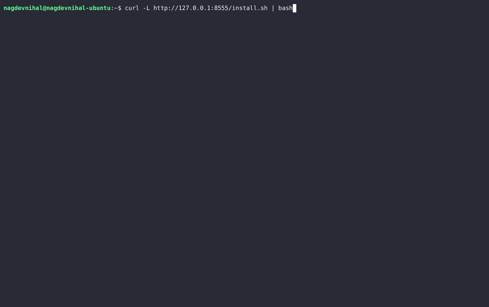
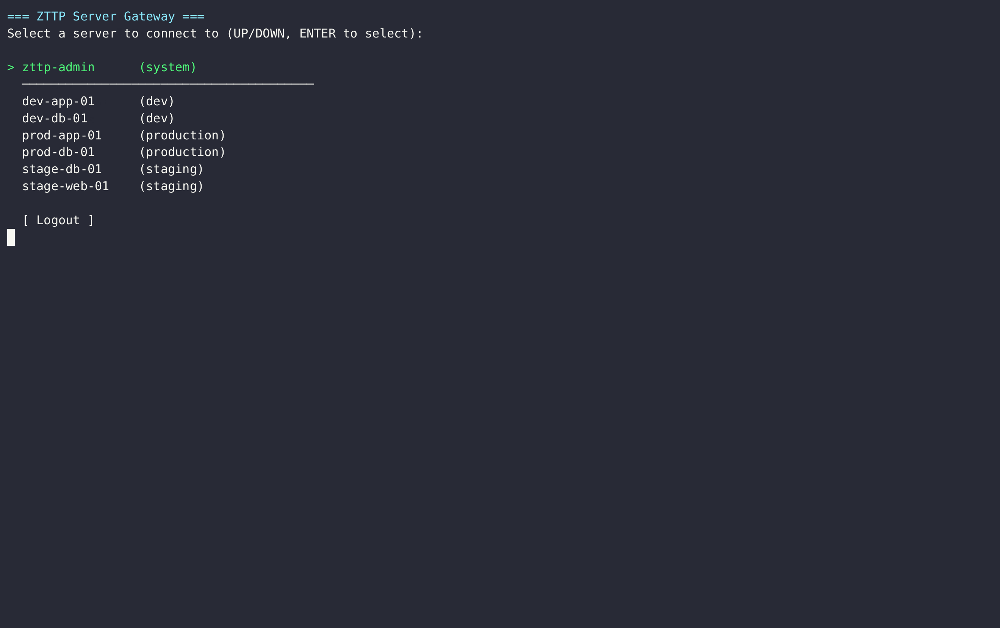
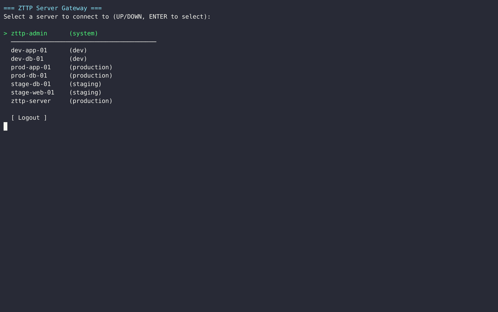
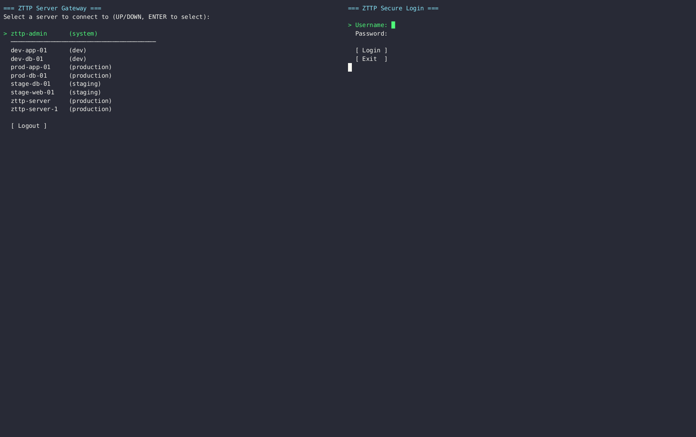

# ZTTP — Zero-Trust Transparent Proxy

> **A hardened, self-hosted SSH bastion host** with Vault-backed key management, RBAC policy enforcement, full session recording, and an interactive admin TUI — designed for teams who need auditable, zero-trust access to production infrastructure.

---

## Table of Contents

- [Why ZTTP](#why-zttp)
- [Architecture Overview](#architecture-overview)
- [Feature Highlights](#feature-highlights)
- [Prerequisites](#prerequisites)
- [Quick Start — Server](#quick-start--server)
- [Quick Start — Client](#quick-start--client)
- [Configuration](#configuration)
- [Roles & RBAC Policy](#roles--rbac-policy)
- [Admin Console](#admin-console)
- [Audit Logs & Session Recordings](#audit-logs--session-recordings)
- [Building from Source](#building-from-source)
- [Makefile Reference](#makefile-reference)
- [Screenshots & Demo](#screenshots--demo)
- [Project Structure](#project-structure)
- [Security Model](#security-model)
- [Contributing](#contributing)
- [License](#license)

---

## Why ZTTP

Modern engineering teams need a way to give developers **the minimum access required** to do their jobs — no more, no less. Traditional SSH key distribution is error-prone: keys get shared, forgotten on laptops, and revoked days too late.

ZTTP solves this by acting as the **single door** into your infrastructure:

| Problem | ZTTP Solution |
|---|---|
| SSH keys shared on laptops | Keys live only in HashiCorp Vault — never on disk |
| No visibility into who did what | Every keystroke is recorded in `.ttyrec` format |
| Blanket production access | Role-based policy engine enforces per-environment rules |
| No way to stop an active session | Kill-switch gRPC endpoint terminates any live session |
| Opaque access for auditors | Admin TUI with session playback, text logs, and admin action logs |

---

## Architecture Overview

```
Developer Laptop
      │
      │  zttp
      │  (Under the hood: SSH over port 2224)
      ▼
┌─────────────────────────────────────────────────────────┐
│                     ZTTP Proxy                          │
│                                                         │
│  ① Auth Gate     — bcrypt/Argon2id login TUI           │
│  ② RBAC Engine   — environment-aware policy check      │
│  ③ Vault Fetch   — ephemeral SSH key retrieval         │
│  ④ Bridge        — transparent TCP tunnel              │
│  ⑤ Audit Writer  — ttyrec frame recorder               │
└──────────┬──────────────────────────────────────────────┘
           │  ssh (private IP, ephemeral key)
           ▼
     Target Server
```

**Infrastructure services (Docker Compose):**

| Service | Purpose |
|---|---|
| `zttp-proxy` | The SSH bastion (Go binary) |
| `zttp-postgres` | Control-plane database (users, servers, RBAC policies) |
| `zttp-vault` | HashiCorp Vault — stores SSH private keys |
| `zttp-nginx` | Serves CLI installers at `/release/` |
| `zttp-init-audit` | One-shot container that fixes volume permissions |

---

## Feature Highlights

- 🔐 **Zero-trust authentication** — Interactive SSH login TUI with bcrypt password hashing, rate limiting, and account lockout after 5 failed attempts
- 🛡️ **RBAC policy engine** — Per-role, per-environment access control with a single optimized PostgreSQL JOIN (no round-trips)
- 🗝️ **Vault-backed SSH keys** — Private keys never touch disk; fetched ephemerally per session from HashiCorp Vault
- 📹 **Full session recording** — All sessions are recorded in `.ttyrec` format with timestamped frames
- 🖥️ **Interactive Admin TUI** — Full terminal UI for user management, server registration, access grants, and log review
- 🔍 **Audit Log Viewer** — Browse sessions by server, replay recordings, or read clean text logs directly from the admin console
- ⚡ **Kill Switch** — gRPC endpoint to terminate any live session instantly
- 📋 **Admin Action Log** — Every administrative action (user creation, access grants, log viewing) is logged to a persistent audit trail
- 🌍 **Multi-platform client** — Single-binary CLI for Linux, macOS (amd64/arm64), and Windows

---

## Prerequisites

**Server (proxy host):**
- Docker ≥ 24 and Docker Compose ≥ 2.20
- A public or LAN-accessible IP on port `2224`
- `make` (optional, but recommended)

**Developer (client):**
- Any SSH client (`ssh` command)
- Linux, macOS, or Windows machine

---

## Quick Start — Server

### 1. Clone the repository

```bash
git clone https://gitlab.com/Nihal799/zttp.git
cd zttp
```

### 2. Configure your environment

```bash
cp .env.example .env
```

Edit `.env` and set at minimum:
```dotenv
PROXY_NODE_IP=<your-server-public-ip>
POSTGRES_PASSWORD=<a-strong-password>
VAULT_TOKEN=<a-strong-vault-token>
```

> ⚠️ **Never commit your `.env` file.** It is listed in `.gitignore`.

### 3. Start all services

```bash
make docker-up
# or directly:
docker compose -f deploy/docker-compose.yml up -d --build
```

### 4. Verify services are healthy

```bash
make docker-ps
curl http://localhost:8080/healthz
```

### 5. Build and publish the CLI installers

```bash
make release PROXY_ADDR=<your-server-ip>:2224
```

This cross-compiles clients for all platforms and auto-updates `dist/install.sh` and `dist/install.ps1` with the correct server URL. The Nginx container serves these at `http://<your-server-ip>:8555/`.

---

## Quick Start — Client

### Linux / macOS

```bash
curl -fsSL http://<proxy-ip>:8555/install.sh | bash
```

### Windows (PowerShell, run as Administrator)

```powershell
irm http://<proxy-ip>:8555/install.ps1 | iex
```

### Connect

Once installed, connect to the ZTTP gateway:

```bash
zttp
# or directly:
ssh -p 2224 <your-username>@<proxy-ip>
```

You will be presented with a terminal login screen. After authentication, you'll see a list of servers you are authorized to access.

---

## Configuration

All configuration is via environment variables (or `.env` file). See `.env.example` for the full reference.

| Variable | Default | Description |
|---|---|---|
| `PROXY_LISTEN_ADDR` | `0.0.0.0:2222` | SSH proxy bind address |
| `HTTP_LISTEN_ADDR` | `0.0.0.0:8080` | Health check HTTP address |
| `GRPC_LISTEN_ADDR` | `0.0.0.0:9090` | Kill-switch gRPC address |
| `PROXY_NODE_IP` | `127.0.0.1` | External IP baked into CLI binaries |
| `DATABASE_URL` | `postgres://zttp:...` | PostgreSQL connection string |
| `VAULT_ADDR` | `http://localhost:8201` | Vault server URL |
| `VAULT_TOKEN` | `dev-root-token-zttp` | Vault root token (dev only — use AppRole in prod) |
| `MAX_FAILED_ATTEMPTS` | `5` | Lockout threshold |
| `LOCKOUT_DURATION` | `15m` | Duration of account lockout |
| `RATE_LIMIT_PER_MIN` | `10` | Max login attempts per minute per IP |
| `AUDIT_LOG_DIR` | `/var/log/zttp/audit` | Path to session recording directory |
| `SOC_WEBHOOK_URL` | *(empty)* | Optional webhook for SOC alerting |

---

## Roles & RBAC Policy

ZTTP uses a **role-based** model. Each user is assigned a role; each role has a policy that defines which server **environments** it can access.

| Role | Access |
|---|---|
| `security-admin` | Full access to all environments + Admin Console |
| `sre-tier1` | All environments including production |
| `sre-tier2` | Staging and development only |
| `dev` | Development environment only |
| `readonly` | Development environment, restricted command set |

> Roles and server assignments are managed through the **Admin Console** (see below). The RBAC engine performs all checks in a single PostgreSQL query — it never exposes *why* access was denied to the client (enumeration protection).

---

## Admin Console

Connect to the `zttp-admin` server from the gateway menu, or log in with an account that has the `security-admin` role.

The Admin Console provides:

| Menu Option | Description |
|---|---|
| **Add User** | Create a new user with role assignment |
| **Add Server** | Register a target server (hostname, IP, environment, SSH user) |
| **Manage Server Access** | Grant or revoke user access to specific servers |
| **View Users** | List all users and their roles |
| **View Servers** | List all registered servers |
| **View Audit Logs** | Browse sessions, replay recordings, read text logs |
| **[ Back ]** | Return to the server gateway |

> All admin actions are logged to `admin-actions.log` inside the audit volume.

---

## Audit Logs & Session Recordings

All sessions are stored in the `zttp-audit-logs` Docker volume (`/var/log/zttp/audit/` inside the container).

### Viewing from the Admin Console

1. Log in as `security-admin`
2. Select **View Audit Logs**
3. Select a server from the list
4. Select a session
5. Choose **View Text Log** (ANSI-stripped, readable) or **Play Recording** (real-time playback)
6. Press `Ctrl+C` to go back

### Viewing from the host (raw)

```bash
# List recordings
sudo ls /var/lib/docker/volumes/zttp-audit-logs/_data/

# Play a recording with ttyplay
sudo ttyplay /var/lib/docker/volumes/zttp-audit-logs/_data/<session-id>.ttyrec

# Read admin actions log
sudo cat /var/lib/docker/volumes/zttp-audit-logs/_data/admin-actions.log
```

---

## Building from Source

**Requirements:** Go 1.25+, Docker (for cross-compilation)

```bash
# Build proxy + CLI for current platform
make build

# Cross-compile CLI for all platforms (Linux, macOS, Windows)
make release PROXY_ADDR=<proxy-ip>:2224

# Run tests
make test

# Run proxy locally (requires Postgres + Vault already running)
make run-proxy
```

---

## Makefile Reference

| Command | Description |
|---|---|
| `make build` | Build proxy and CLI for current platform |
| `make release` | Cross-compile CLI binaries for all platforms |
| `make release-docker` | Cross-compile inside a Docker container (avoids snap/WSL issues) |
| `make docker-up` | Start all Docker Compose services |
| `make docker-down` | Stop all services and delete volumes |
| `make docker-logs` | Tail proxy logs |
| `make docker-ps` | Show container status |
| `make test` | Run all Go tests |
| `make migrate` | Apply database migrations |
| `make seed` | Seed development data |
| `make hashpw PW=mypassword` | Generate a bcrypt hash for manual DB seeding |
| `make clean` | Remove compiled binaries and build cache |

---

## Screenshots & Demo

### 1. Installation
[](docs/screenshots/install.gif)
*(Click to play demo)*

### 2. Secure Login
[](docs/screenshots/login.gif)
*(Click to play demo)*

### 3. Add Server (Admin Console)
[](docs/screenshots/add-server.gif)
*(Click to play demo)*

### 4. Connect to Server (Gateway)
[](docs/screenshots/connect-server.gif)
*(Click to play demo)*

### 5. Kill Switch (Admin Eject)
[](docs/screenshots/kill-terminal.gif)
*(Click to play demo)*

---

## Project Structure

```
zttp/
├── cmd/
│   ├── proxy/          # Proxy server entrypoint
│   └── zttp/           # CLI client entrypoint
├── db/
│   └── migrations/     # PostgreSQL schema migrations
├── deploy/
│   ├── docker-compose.yml
│   ├── Dockerfile.proxy
│   └── vault-seed.sh   # Seeds test SSH keys into Vault
├── dist/
│   ├── install.sh      # Linux/macOS installer script
│   └── install.ps1     # Windows installer script
├── internal/
│   ├── audit/          # Admin action logging
│   ├── auth/           # User authentication (bcrypt, lockout)
│   ├── cli/            # CLI client TUI and connect logic
│   ├── config/         # Environment-based configuration
│   ├── killswitch/     # gRPC kill-switch service
│   ├── proxy/          # SSH proxy, gateway TUI, admin TUI, bridge
│   ├── rbac/           # Role-based access control engine
│   ├── ratelimit/      # Per-IP rate limiting
│   ├── session/        # Session tracking and DB store
│   └── vault/          # HashiCorp Vault SSH key client
├── proto/              # gRPC protocol definitions
├── tools/
│   └── hashpw/         # CLI tool: generate bcrypt password hash
├── .env.example        # Configuration template
├── go.mod
└── Makefile
```

---

## Security Model

| Layer | Mechanism |
|---|---|
| **Transport** | All client connections are SSH (encrypted in transit) |
| **Authentication** | bcrypt (cost 12) / Argon2id — plaintext is structurally prohibited in the schema |
| **Brute-force protection** | Account lockout (5 attempts / 15 min) + per-IP rate limiter |
| **Authorization** | Single-JOIN RBAC query — denials are always generic ("Permission denied") |
| **Secret management** | SSH private keys stored exclusively in HashiCorp Vault, fetched ephemerally |
| **Audit trail** | Full keystroke recording in `.ttyrec` format, immutable append-only admin log |
| **Process isolation** | Proxy runs as non-root (`UID 65532`) inside a distroless container |
| **Kill switch** | Any live session can be terminated via gRPC without restarting the proxy |

---

## Contributing

1. Fork the repository
2. Create a feature branch: `git checkout -b feat/your-feature`
3. Make your changes, ensuring each file gets its own commit
4. Run tests: `make test`
5. Open a merge request

Please do not commit:
- `.env` or any file containing secrets
- Real IP addresses or hostnames of production servers
- Compiled binaries (the `zttp` binary in the root is `.gitignore`d)

---

## License

This project is proprietary. All rights reserved.

---

*Built with Go, PostgreSQL, HashiCorp Vault, and Docker.*
